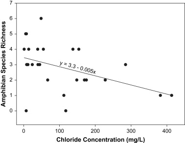

github link: [Link](https://github.com/jensenbrown19/assignment5.git

reference: Collins, S.J. and Russell, R. W. (2009) Toxicity of road salt to Nova Scotia amphibians. *Environmental Pollution, 157*(1), 320-324. DOI: 10.1016/j.envpol.2008.06.032

## Introduction

  Here in Atlantic Canada, the release of chemical pollutants into wetlands from roadside runoff is a large issue. One of the most popular pollutants we see is salt (NaCl), which is used to help dissolve ice that forms on paved roads during the winter. In this study, 26 roadside ponds were surveyed for amphibian species richness and chloride concentration. It was concluded that chloride concentrations in ponds due to the application of de-icing salts on roads influenced community structure by excluding salt intolerant species.
  
## Methods

  26 ponds within 60m of secondary roads or highways were sampled for presence of various amphibian species. Auditory surveys were conducted from April through July between 10:00 pm and 4:00 am, and consisted of listening for distinctive calls of amphibian species. Each pond was surveyed 14 times over the entire sampling period, with approximately 3 to 5 minutes spent listening during each sampling at each site.
  Larvae of five amphibian species were exposed to salt in the laboratory by acute toxicity tests conducted at 10 different salt concentrations, and a control composed of dechlorinated Halifax tap water. Each test consisted of 4 replicates, each with 6 tadpoles per treatment, for a total of 24 tadpoles per test concentration, and 240 tadpoles of each amphibian species. Testing ran for a total of 96 hours, after which all specimen were removed and weighed.
  
## Results

  8 of the 12 amphibian species present in Nova Scotia were observed in the study ponds. Mean species richness was 2.8 ± 0.3 species. There was no relationship detected between the distance to the road and the species richness found within the ponds. There was however a significant relationship between chloride concentration in ponds and amphibian species richness, as seen in figure 1. Species richness decreased with increasing chloride concentration. 